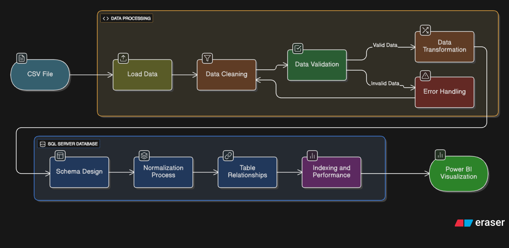
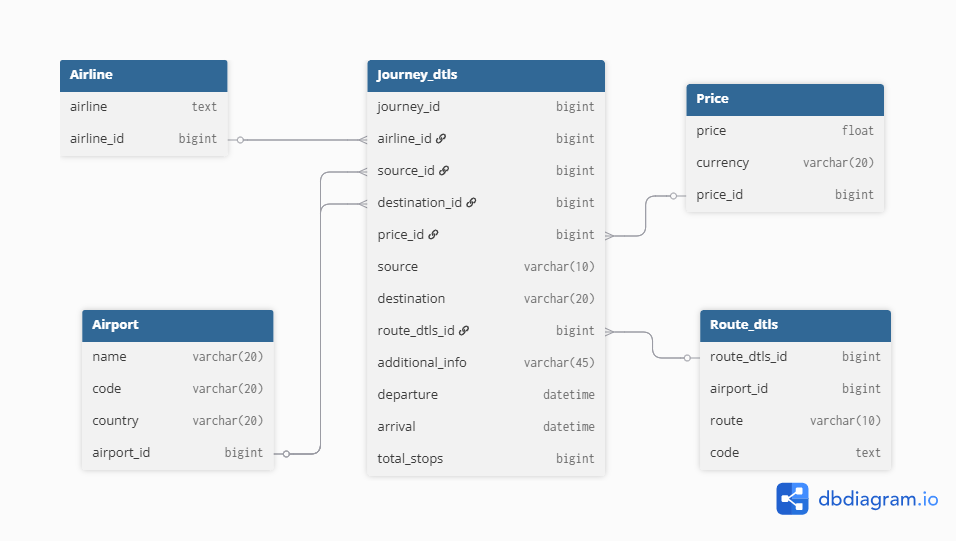

# Flight ETL Data Visualization 📈

## Visualization : -


## Power BI Dashboard: Key Visualizations

**Average Price per Route:** This chart highlights route-specific pricing patterns. For example, routes like Delhi–Cochin show higher average prices (10.5K), while others such as Kolkata and Hyderabad present more moderate pricing.

**Journey Volume by Airline:**: Bar charts display the count of journeys by airline, with Jet Airways (3.85K), IndiGo (2.05K), and Air India (1.75K) leading. This helps pinpoint popular carriers and market shares across different regions.

**Departure Count by Month:**
Monthly breakdowns reveal seasonal demand, with May (3.47K) and June (3.41K) showing peak traffic volumes. Such insights guide planning for peak vs. off-peak flight operations.

**Total Prices and Duration Analysis:**
Aggregate metrics include a total sum of price (97.08M97.08M), a count of journeys (57M57M), and total flight duration hours (114K114K). These indicators expose operational volumes and average trip characteristics.

**Market Segmentation and Premium Classes:**
Visuals segment journey counts by class - Multiple Carriers, Premium Economy, Jet Airways Business, etc. - enabling fine-grained analysis of luxury travel trends and product mix effectiveness.

**Geographic Insights:**
Destination-based visualizations, possibly using Power BI maps, provide spatial insights into flight patterns and popular destinations (supported by Esri maps integration).

--- 

## Work Flow: -


## 📌 Overview

This project automates a pipeline that:

- Extracts flight data from CSV files  
- Transforms and normalizes the data using Python and Pandas  
- Loads the cleaned, structured data into a SQL Server database  
- Visualizes the data in Power BI based on the SQL Server tables  

**Goal**: Provide interactive dashboards for exploring flight metrics (e.g. delays, cancellations, routes) with clean, queryable data stored in relational schema.

---

## 📂 Repository Structure

| File / Folder            | Purpose                                                  |
|--------------------------|----------------------------------------------------------|
| `data/`                  | Raw CSV files / datasets used as input for ETL           |
| `extract.py`             | Script to read CSV(s), initial extraction                |
| `transform.py`           | Data cleaning, transformations, normalization            |
| `tablestructure.py`      | Definition of SQL schema / table structure (DDL)         |
| `load.py`                | Loads transformed data into SQL Server tables            |
| `main.py` / `main.ipynb` | Orchestrates the ETL pipeline; notebook for exploration |
| `Flight_analysis.pbix`   | Power BI file with dashboards / reports                  |

---

## ⚙️ Prerequisites

- Python **3.x**  
- `pandas` library  
- SQL Server (or compatible instance)  
- Power BI Desktop / Power BI Service (for `.pbix` file)  
- Python DB connector (`pyodbc` or equivalent)  

---

## 🚀 Setup

Clone the repo:
```bash
git clone https://github.com/Ankush-Sonar/flight-ETL-data-visualization.git
cd flight-ETL-data-visualization
Install Python dependencies:
```
Install sqlalchemy:
```bash
pip install pandas sqlalchemy pyodbc
```
--- 

## Prepare SQL Server:
- Ensure the SQL Server is running.
- Create a database (name as per your config).
- Grant access to user credentials used in scripts.

## Entity-Relationship Diagram


Configure connection settings:
- Update connection strings in load.py (or equivalent) to point to your SQL Server hostname, database, user/password, or integrated authentication.

---

## ▶️ Usage

Run the ETL pipeline in sequence:

Extraction:

```bash
python extract.py
```

Transformation:

```bash
python transform.py
```

Schema setup:
```bash
python tablestructure.py
```

Load into database
```bash
python load.py
```

## 📈 Visualization

1. Open Flight_analysis.pbix in Power BI.
2. Connect to SQL Server.
3. Build or view dashboards.
--- 

## 🗄️ Data Model & Normalization

- The schema is normalized: redundant information is removed.
- related entities are stored in distinct tables.
- Likely tables include: flights, carriers, airports, delay types, routes.
- Primary and foreign keys ensure referential integrity.
---

## 📊 Examples of Analyses / Dashboards

- Flight delays by airline, airport, or route
- Time-series analysis of cancellations
- Comparison of arrival vs departure delays
- Top routes by traffic volume
---

🔧 Configuration & Customization

- Replace CSVs in data/ with updated datasets.
- Modify transform.py for new fields or schema changes.
- Extend tablestructure.py with new dimensions.
- In Power BI, adjust visuals or add new reports.
---

## 🛠️ Troubleshooting

| Issue                           | Possible Cause                     | Solution                                                                 |
|---------------------------------|------------------------------------|--------------------------------------------------------------------------|
| Connection errors to SQL Server | Wrong credentials / network issues | Check connection string; ensure server allows remote access              |
| Missing or malformed data       | CSV schema changed / null values   | Add validations in `transform.py`, handle nulls, clean datatypes         |
| Dashboard not refreshing        | Query fails / wrong table names    | Verify schema; ensure PBIX is linked to correct tables                   |
---
  
## 📌 Future Improvements

- Automate with Airflow or cron jobs
- Add unit tests for transform logic
- Data quality checks and logging
- Advanced dashboards (maps, predictive models)
- Deploy Power BI reports to the cloud

👤 Author


Ankush Sonar

GitHub: Ankush-Sonar
